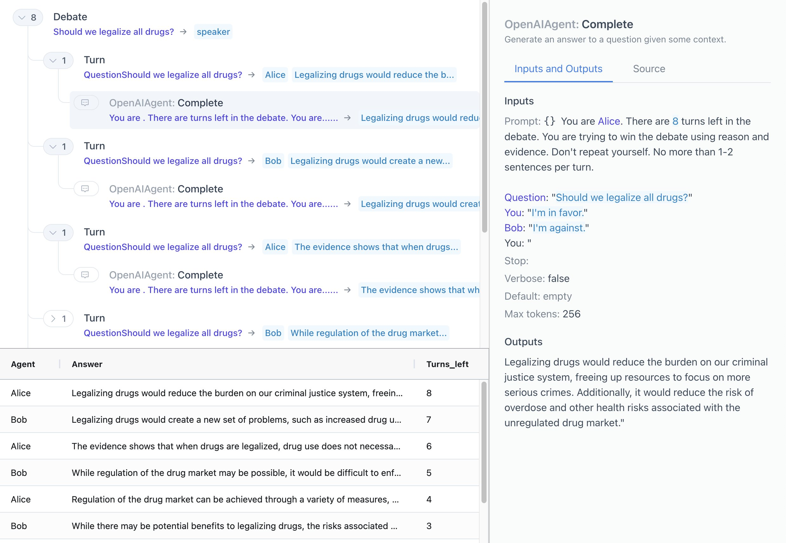

# `fvalues`

[](https://github.com/oughtinc/fvalues/actions) [](https://coveralls.io/github/oughtinc/fvalues?branch=main)

This is a Python library for keeping track of the combination of components in a string. In particular it lets you separate out the formatted values in an f-string. Here's an example:

```python
from fvalues import F, FValue

x = 1.2345
f = F(f"twice x is {x * 2:.2f}")
assert f == "twice x is 2.47"
assert f.parts == ("twice x is ", FValue(source="x * 2", value=2.469, formatted="2.47"))
```

Key facts:

- `F` is a subclass of `str` so it can generally be used like any other string.
- Calls to the constructor `F()` are magically detected using the `executing` library, and f-strings within are parsed to extract their components.
- These are saved in the attribute `F.parts`. Each `part` is either a `str` representing a constant section or an `FValue` representing a dynamic expression.
- `FValue.source` contains the source code between the braces (`{}`) but before the colon (`:`) and format spec (`.2f`). In some cases it may not be the exact original source code, but equivalent code produced by `ast.unparse`.
- `FValue.value` and `FValue.formatted` are calculated using `eval()`, so **be careful of expressions that you wouldn't want to evaluate twice due to performance or side effects**.

## Usage in ICE

This library was built to enhance the [Interactive Composition Explorer (ICE)](https://github.com/oughtinc/ice). In the screenshot below, the prompt under 'Inputs' on the right is an `F` object, and the colored text corresponds to dynamic `FValue`s.



## Concatenation

The `F` class also has special support for concatenation with the `+` operator:

```python
f += "!"
assert f == "twice x is 2.47!"
assert f.parts == (
    FValue(
        source="f",
        value="twice x is 2.47",
        formatted="twice x is 2.47",
    ),
    "!",
)
```

Similar to deconstructing f-strings, you can see how the parts distinguish between the dynamic expression `f` on the left of `+=`, representing it as an `FValue`, and the static `"!"` on the right.

## Flattening

In the assertion above above, `FValue.value` is shown as a plain string, but remember that it's actually also an `F` object itself. The assertion works because `F` is a subclass of `str` so they can be used interchangeably. But it still has the same `parts` that we saw earlier. Sometimes keeping the tree of parts in its original form can be useful, other times you may want to bring everything to the surface to make things easier. You can produce an equivalent `F` object with a flat list of parts using `F.flatten`:

```python
assert f.flatten().parts == (
    "twice x is ",
    FValue(
        source="x * 2",
        value=2.469,
        formatted="2.47",
    ),
    "!",
)
```

## Other string methods

Most `F` methods (e.g. `.lower()`) are directly inherited from `str`, which means that they return a plain `str` rather than another `F` object. So be careful with those methods if you don't want to lose information about the parts! The methods below have specialised implementations to avoid this. More may be added in the future.

### `strip`

`F.strip` does the same thing as the usual `str.strip` as far as the whole string is concerned, but also strips the internal parts in the way you'd probably expect. See the docstring for more details. The related methods `lstrip` and `rstrip` strip the left/right sides as expected.

Make sure to write `F(f"...").strip()` rather than `F(f"...".strip())` or the f-string magic won't work.

### `join`

`separator.join(strings)` will return an `F` object only if `separator` is an `F` object. If `separator` is a plain `str`, then the result will be a plain `str`, even if `strings` is a list of `F` objects. In practice, this typically means you should write e.g. `F(" ").join(strings)` rather than `" ".join(strings)`.
